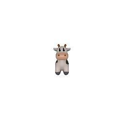
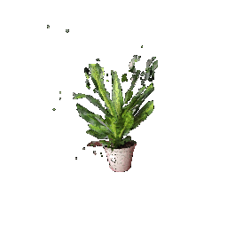
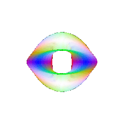

HW1 16825 - vinayakp
==============================================

Results

### Q.1

### Cow 360

### Dolly Zoom

### Q.2

### Tetrahedron

### Cube

### Q.3
### Retexturing

### Q.4

### Camera Transformations

 For this image, I rotated the object (I considered object as a reference for all operations) about z-axis 90 degrees in clockwise direction

 For this case, I rotated the object about y-axis 90 degrees in clockwise direction. I also pushed the object 3 units in -ve x direction and +ve 3 units in z direction

 For this view, I pushed the object in positive z axis by a unit of 3

 For this arrangement, I moved the cow 0.5 units in +ve x direction and 0.5 units in -ve y direction

### Q.5

### 5.1. Rendering Generic 3D Representations

  

### 5.2. Parametric Functions

### Torus

### Square Torus

### 5.3. Implicit Surfaces

#### Trade-offs between meshes and point-clouds

Point clouds are more memory efficient than meshes as they only contain point coordinates whether meshes have point coordinates as well as the face connectivity information. Points are also more suitable for neural network based shape prediciton as well as while working with changing connectivity. However, point clouds produce low quality renders due to the voids in between the points whereas meshes contain connectivity information thats fills the gaps between the points. Meshes are also very compatible with most 3D simulation based softwares.

### 6\. Do Something Fun

